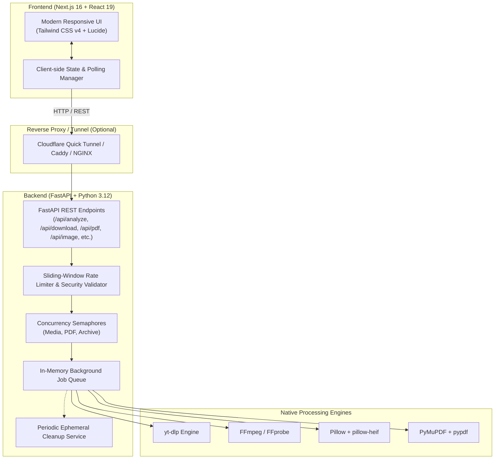

# ClipFetch ⚡

<div align="center">

[](https://nextjs.org/)
[](https://react.dev/)
[](https://fastapi.tiangolo.com/)
[](https://www.python.org/)
[](https://tailwindcss.com/)
[](https://www.typescriptlang.org/)
[](https://www.docker.com/)
[](https://opensource.org/licenses/MIT)

**A calm, powerful, and privacy-first workspace for all your media, video, image, PDF, and archive needs.**

[Explore Features](#-features--tools-catalog) • [Architecture](#-architecture) • [Quickstart](#-quickstart-guide) • [Docker](#-docker-setup) • [Cloudflare Quick Tunnel](#-cloudflare-quick-tunnel-local--vercel) • [API Docs](#-api-documentation) • [Security & Legal](#-security--resource-safeguards)

---

</div>

## 📖 Overview

**ClipFetch** is a modern media processing workspace built for creators, developers, and everyday users. Originally designed as an ethical, high-performance media downloader, ClipFetch has evolved into a comprehensive digital utility suite. 

ClipFetch allows you to analyze permitted video metadata, download custom quality presets, trim and transcode videos, convert and compress photos (including Apple HEIC), manipulate PDFs (merge, split, reorder, compress, extract text), and create/extract archives — **all within a single, distraction-free interface without ads, popups, or cloud tracking**.

> [!IMPORTANT]
> **Permitted Content Notice**: ClipFetch is engineered strictly for authorized, public domain, and user-owned content. Users are solely responsible for respecting copyright laws, digital rights, and the terms of service of any source platform.

---

## ✨ Features & Tools Catalog

ClipFetch is organized into five dedicated suites:

### 🎬 1. Video & Audio Downloader
* **Metadata Analysis**: Paste any supported video URL to fetch real-time metadata (title, uploader, duration, thumbnail, and stream bitrate details).
* **Format & Preset Selection**: Pick from various video qualities (1080p, 720p, 480p, 360p) or separate audio streams (MP3, WAV, M4A).
* **Background Processing**: Asynchronous download jobs with thread-safe polling progress updates.
* **Clip Trimming**: Define optional start and end timestamps to download only the section you need.

### ✂️ 2. Video & Audio Studio
* **Video Editor**: Trim video clips, adjust playback speed (0.5x to 2.0x), rescale dimensions, tune output quality, and toggle audio tracks.
* **Video to GIF**: Convert video sequences into high-quality, shareable GIFs with custom FPS and resolution controls.
* **Frame Extractor**: Grab precise frame snapshots at any timestamp as JPG or PNG.
* **Audio Extractor**: Strip audio tracks from video files directly into MP3, WAV, M4A, or OGG.
* **Media Transcoder**: Convert between popular container formats (`.mp4`, `.webm`, `.mov`, `.mp3`, `.wav`).

### 🖼️ 3. Image Processing & Photo Studio
* **Image Format Conversion**: Instant two-way conversion between **JPG**, **PNG**, and **WebP**.
* **Apple HEIC Support**: Convert `.heic` photos from iOS devices into standard `.jpg`.
* **Smart Compression**: Compress images with visual quality sliders to drastically reduce file sizes.
* **Resize & Crop**: Precise pixel dimensions or fixed aspect ratio cropping (1:1, 16:9, 4:3, etc.).
* **Rotate & Flip**: 90° / 180° / 270° orientation rotation and horizontal/vertical flipping.

### 📄 4. PDF Power Tools
* **Merge PDF**: Combine multiple PDF documents in any order into a single unified file.
* **Split PDF**: Extract all individual pages into a ZIP archive or specify custom page ranges (e.g., `1-3, 5, 7-10`).
* **Compress PDF**: Optimize document streams and structural metadata to reduce size without sacrificing readability.
* **PDF to Images**: Render pages into high-resolution PNG images bundled in a ZIP archive.
* **Images to PDF**: Convert and arrange image sequences (JPG, PNG, WebP) into a clean, multi-page PDF.
* **Page Manager**: Visually reorder pages, delete unneeded pages, and re-export.
* **PDF to Text**: Extract raw text content directly into clean `.txt` files.
* **Thumbnail Generator**: Fast preview thumbnails rendered on the fly.

### 📦 5. File & Archive Tools
* **ZIP Creator**: Bundle multiple mixed files into an organized `.zip` file.
* **ZIP Inspector**: Safely inspect file manifests, uncompressed sizes, and paths inside archives before extracting.
* **ZIP Extractor**: Extract archives with built-in path sanitization to guard against directory traversal / zip-slip exploits.

---

## 🏛 Architecture

ClipFetch decouples a high-performance **Next.js 16 (App Router)** client from an asynchronous **FastAPI** backend processing service.



---

## 🛠 Tech Stack

| Domain | Technology | Details |
| :--- | :--- | :--- |
| **Frontend Framework** | Next.js 16.3 | App Router, Server Components & Client Workspaces |
| **UI Library** | React 19 | Fast interactive state and component trees |
| **Styling & Design** | Tailwind CSS v4 | Dark mode aesthetic, responsive grid system |
| **Icons** | Lucide React | Clean, lightweight icon suite |
| **Backend Framework** | FastAPI 0.141 | High-throughput asynchronous Python framework |
| **Validation & Settings**| Pydantic v2 & Pydantic-Settings | Strict typing, environment validation, schema generation |
| **Media Extraction** | yt-dlp & FFmpeg | Reliable metadata extraction, audio/video transcoding |
| **Document Processing**| PyMuPDF (fitz) & pypdf | Blazing-fast PDF manipulation, text extraction, page splitting |
| **Image Engine** | Pillow 11.3 & pillow-heif | Image manipulation, resizing, compression, HEIC decoding |
| **Containerization** | Docker & Docker Compose | Multi-stage production container builds |

---

## 📂 Project Structure

```text
.
├── .env.example              # Global environment configuration template
├── .gitignore                # Git ignore rules for node_modules, .venv, downloads
├── docker-compose.yml        # Multi-container orchestration (frontend + backend)
├── README.md                 # Project documentation
├── scripts/                  # Automated PowerShell helper scripts
│   ├── start-backend.ps1     # Launch FastAPI with custom CORS origins
│   ├── check-backend.ps1     # Verify local or remote backend health
│   └── start-cloudflared.ps1 # Launch zero-config Cloudflare Quick Tunnel
├── backend/
│   ├── app/
│   │   ├── config.py         # Pydantic Settings & environment parsing
│   │   ├── errors.py         # Unified ClipFetch custom exceptions
│   │   ├── main.py           # FastAPI entrypoint, middleware, lifespan
│   │   ├── models.py         # Pydantic request/response schemas
│   │   ├── routes/
│   │   │   ├── archive.py    # ZIP create, inspect, extract endpoints
│   │   │   ├── file.py       # Video edit, convert, GIF, frame extraction
│   │   │   ├── health.py     # Health status and Jinja2 HTML dashboard
│   │   │   ├── image.py      # Image convert, compress, crop, resize, rotate
│   │   │   ├── media.py      # yt-dlp analyze & download job routes
│   │   │   └── pdf.py        # PDF merge, split, compress, pages, OCR/text
│   │   ├── services/
│   │   │   ├── archive_tools.py # Zipfile manipulation routines
│   │   │   ├── cleanup.py    # Background thread for old temp file removal
│   │   │   ├── downloader.py # Download job thread pool & progress monitor
│   │   │   ├── extractor.py  # yt-dlp wrapper & metadata parser
│   │   │   ├── image_tools.py# Pillow manipulation & HEIC routines
│   │   │   ├── media_tools.py# FFmpeg process execution & filters
│   │   │   └── pdf_tools.py  # PyMuPDF/pypdf routines
│   │   ├── templates/        # Jinja2 HTML server status page
│   │   └── utils/
│   │       ├── concurrency.py# Async semaphores for heavy CPU workloads
│   │       ├── files.py      # Upload handling & directory lifecycle
│   │       ├── rate_limit.py # In-memory sliding window rate limiters
│   │       └── validation.py # URL validation & SSRF protection
│   ├── Dockerfile            # Python 3.12-slim + FFmpeg container image
│   ├── requirements.txt      # Python dependencies
│   └── tests/                # Pytest suites
│       ├── test_health.py
│       └── test_validation.py
└── frontend/
    ├── app/
    │   ├── globals.css       # Tailwind CSS styles and custom utility classes
    │   ├── layout.tsx        # Base root layout, header, footer
    │   ├── page.tsx          # Homepage with tool catalog & search
    │   └── tools/
    │       └── [slug]/       # Dynamic tool workspace runner
    ├── components/
    │   ├── DownloaderCard.tsx# Interactive media downloader component
    │   ├── Header.tsx        # Navigation header
    │   ├── Footer.tsx        # Footer with legal disclaimer
    │   └── tools/            # Specialized workspace components (Video, PDF, Image, etc.)
    ├── Dockerfile            # Node 20-alpine Next.js production build
    ├── package.json          # Node dependencies & scripts
    └── tsconfig.json         # TypeScript configuration
```

---

## 📋 Prerequisites

Before running ClipFetch locally, ensure your machine has:

- **Node.js**: `v20.0.0+`
- **npm**: `v10.0.0+`
- **Python**: `3.12+`
- **FFmpeg & FFprobe**: Installed and added to system `PATH`

### FFmpeg Installation

<details>
<summary><b>Windows</b></summary>

Install via Windows Package Manager (`winget`):
```powershell
winget install Gyan.Dev.FFmpeg
```
*Or download the release build from [ffmpeg.org](https://www.ffmpeg.org/download.html) and add the `bin/` directory to your System Environment Variables `PATH`.*

Verify in PowerShell:
```powershell
ffmpeg -version
ffprobe -version
```
</details>

<details>
<summary><b>macOS</b></summary>

Install via Homebrew:
```bash
brew install ffmpeg
```
</details>

<details>
<summary><b>Linux (Ubuntu/Debian)</b></summary>

```bash
sudo apt-get update
sudo apt-get install -y ffmpeg
```
</details>

---

## 🚀 Quickstart Guide

### 1. Clone the Repository
```bash
git clone https://github.com/<your-username>/clipfetch.git
cd clipfetch
```

### 2. Configure Environment Variables
Copy the root `.env.example` file:

**Bash:**
```bash
cp .env.example .env
cp .env.example frontend/.env.local
```

**PowerShell:**
```powershell
Copy-Item .env.example .env
Copy-Item .env.example frontend/.env.local
```

---

### 3. Backend Setup

**Windows (PowerShell):**
```powershell
# Create and activate virtual environment
python -m venv .venv
.\.venv\Scripts\Activate.ps1

# Install dependencies
pip install -r backend\requirements.txt

# Run FastAPI backend
cd backend
uvicorn app.main:app --reload --port 8000
```

**Linux / macOS:**
```bash
# Create and activate virtual environment
python3 -m venv .venv
source .venv/bin/activate

# Install dependencies
pip install -r backend/requirements.txt

# Run FastAPI backend
cd backend
uvicorn app.main:app --reload --port 8000
```

> **Backend Access:**
> - API Root / HTML Dashboard: [http://localhost:8000](http://localhost:8000)
> - Interactive Swagger UI: [http://localhost:8000/docs](http://localhost:8000/docs)
> - Service Health Check: [http://localhost:8000/api/health](http://localhost:8000/api/health)

---

### 4. Frontend Setup

Open a new terminal session in the project root:

```bash
cd frontend
npm install
npm run dev
```

> **Frontend Access:**
> - Web Application: [http://localhost:3000](http://localhost:3000)

---

### 5. Running Automated Tests

**Backend (Pytest):**
```bash
pytest backend/tests -v
```

**Frontend (Jest & Testing Library):**
```bash
cd frontend
npm test
```

---

## 🐳 Docker Setup

ClipFetch includes full Docker and Docker Compose support out of the box. FFmpeg, Python dependencies, Node packages, and volume permissions are handled automatically inside the containers.

```bash
# Build and spin up both containers
docker compose up --build
```

- **Frontend** will be live at: `http://localhost:3000`
- **Backend** will be live at: `http://localhost:8000`
- Downloads and scratch files are stored safely inside the Docker volume `backend_downloads`.

To stop the containers:
```bash
docker compose down
```

---

## 🌐 Cloudflare Quick Tunnel (Local + Vercel)

Want to test your production frontend on **Vercel** connected to your local backend **without port-forwarding, DNS setup, or paying for hosting**? Use a free Cloudflare Quick Tunnel.

```text
[ Vercel Frontend (HTTPS) ] 
       │
       ▼
[ Cloudflare Quick Tunnel (https://*.trycloudflare.com) ]
       │
       ▼
[ Local Machine (http://localhost:8000) - FastAPI ]
```

### Setup Steps:

1. **Install `cloudflared`**:
   - Download the Windows binary from [Cloudflare](https://developers.cloudflare.com/cloudflare-one/connections/connect-networks/downloads/) or place `cloudflared-windows-amd64.exe` on your system.
   - Verify: `cloudflared --version`.
2. **Execute Helper Scripts (in separate terminals)**:

   ```powershell
   # Terminal 1: Start FastAPI with your Vercel URL permitted in CORS
   powershell.exe -NoProfile -ExecutionPolicy Bypass -File .\scripts\start-backend.ps1 -FrontendOrigin https://your-project.vercel.app

   # Terminal 2: Verify local FastAPI before exposing it
   powershell.exe -NoProfile -ExecutionPolicy Bypass -File .\scripts\check-backend.ps1

   # Terminal 3: Launch the Cloudflare Quick Tunnel
   powershell.exe -NoProfile -ExecutionPolicy Bypass -File .\scripts\start-cloudflared.ps1
   ```

3. **Configure Vercel**:
   - Copy the generated `https://<unique-subdomain>.trycloudflare.com` URL printed in Terminal 3.
   - Go to **Vercel Project Settings > Environment Variables**.
   - Set `NEXT_PUBLIC_API_URL` to that URL.
   - Redeploy the frontend.

---

## 🚢 Production Deployment

```text
+-------------------------+            +---------------------------------+
|     Vercel Deployment   |            |  Docker Host (VPS / Cloud VM)   |
|   (Next.js 16 Frontend) | ---------> |   (FastAPI + yt-dlp + FFmpeg)   |
|  NEXT_PUBLIC_API_URL    |   HTTPS    |      FRONTEND_ORIGIN            |
+-------------------------+            +---------------------------------+
```

> [!WARNING]
> **Do not deploy the FastAPI backend as a Vercel Serverless Function**. yt-dlp, FFmpeg transcoding, and in-memory background download jobs require a persistent runtime environment with binary utilities installed.

### 1. Backend on a VPS (Docker / Ubuntu / Debian)
1. Install Docker on your server.
2. Clone this repository onto the server.
3. Build the backend Docker image:
   ```bash
   docker build -t clipfetch-backend ./backend
   ```
4. Run the container with persistent storage and your Vercel URL configured:
   ```bash
   docker run -d --name clipfetch-backend \
     --restart unless-stopped \
     -p 8000:8000 \
     -e FRONTEND_ORIGIN="https://clipfetch.vercel.app" \
     -v clipfetch-downloads:/app/downloads \
     clipfetch-backend
   ```
5. Place an SSL reverse proxy (such as Caddy, NGINX, or Cloudflare) in front of port 8000 to serve over `https://api.yourdomain.com`.

### 2. Frontend on Vercel
1. Import the repository into [Vercel](https://vercel.com/).
2. Set the **Root Directory** to `frontend`.
3. Add Environment Variable:
   - `NEXT_PUBLIC_API_URL`: `https://api.yourdomain.com`
4. Deploy!

---

## ⚙️ Configuration & Environment Variables

| Variable | Default Value | Description |
| :--- | :--- | :--- |
| `BACKEND_PORT` | `8000` | Port on which the FastAPI application listens |
| `FRONTEND_ORIGIN` | `http://localhost:3000,http://127.0.0.1:3000` | Allowed CORS origins (comma-separated list) |
| `NEXT_PUBLIC_API_URL` | `http://localhost:8000` | Target backend URL embedded in the frontend bundle |
| `MAX_DOWNLOAD_SIZE_MB`| `2048` | Hard size ceiling for downloaded media files (MB) |
| `MAX_UPLOAD_SIZE_MB` | `200` | Hard size ceiling for file uploads (MB) |
| `MAX_CONCURRENT_DOWNLOADS` | `2` | Number of simultaneous background download worker threads |
| `TEMP_FILE_RETENTION_MINUTES` | `30` | Age after which completed download files are automatically pruned |
| `MAX_ANALYZE_REQUESTS_PER_MINUTE` | `20` | Rate limit for metadata extraction requests |
| `MAX_DOWNLOAD_REQUESTS_PER_MINUTE` | `10` | Rate limit for download job creations |
| `DOWNLOAD_DIR` | `downloads` | Local filesystem directory for storing temporary output files |
| `REQUEST_TIMEOUT_SECONDS` | `45` | Network timeout for remote metadata inspection |
| `RATE_LIMIT_WINDOW_SECONDS` | `60` | Rolling time window for client IP rate limiters |

---

## 📡 API Documentation

Interactive OpenAPI documentation is generated automatically by FastAPI:
- **Swagger UI**: `http://localhost:8000/docs`
- **ReDoc**: `http://localhost:8000/redoc`
- **Server Health Dashboard**: `http://localhost:8000/`

### Primary Endpoints Overview

| Method | Endpoint | Description |
| :--- | :--- | :--- |
| `GET` | `/api/health` | Healthcheck (yt-dlp, FFmpeg, and storage readiness) |
| `POST`| `/api/analyze` | Validate URL and extract media metadata & formats |
| `POST`| `/api/download` | Queue background media download job |
| `GET` | `/api/download/{job_id}/status` | Poll download job status, progress %, and speed |
| `GET` | `/api/download/{job_id}/file` | Stream or download the completed media file |
| `POST`| `/api/media/convert` | Transcode audio or video to another format |
| `POST`| `/api/media/edit` | Trim, resize, or alter playback speed of a video |
| `POST`| `/api/media/video-to-gif` | Convert video clip into an animated GIF |
| `POST`| `/api/media/extract-frame`| Extract an exact video frame at a given timestamp |
| `POST`| `/api/image/convert` | Convert images between JPG, PNG, and WebP |
| `POST`| `/api/image/compress` | Compress image with adjustable quality slider |
| `POST`| `/api/image/resize` | Resize image by width/height maintaining aspect ratio |
| `POST`| `/api/image/crop` | Crop image with bounding box coordinates |
| `POST`| `/api/image/rotate` | Rotate (90/180/270°) and flip (horizontal/vertical) |
| `POST`| `/api/pdf/merge` | Merge multiple PDF files into one |
| `POST`| `/api/pdf/split` | Split PDF into individual pages or specific ranges |
| `POST`| `/api/pdf/compress` | Compress PDF document streams |
| `POST`| `/api/pdf/to-images` | Convert PDF pages into PNG images in a ZIP |
| `POST`| `/api/pdf/from-images` | Convert multiple image uploads into a single PDF |
| `POST`| `/api/pdf/manage` | Reorder and delete specific pages from a PDF |
| `POST`| `/api/pdf/to-text` | Extract readable text content from a PDF |
| `POST`| `/api/file/create-zip` | Package multiple files into a clean ZIP archive |
| `POST`| `/api/file/inspect-zip`| View archive structure and file sizes before extracting |
| `POST`| `/api/file/extract-zip`| Securely unpack archive contents |

---

## 🔒 Security & Resource Safeguards

ClipFetch is built from the ground up with defensive engineering practices:

* **Strict SSRF Mitigation**: Every requested video URL is resolved and checked against RFC 1918 private IP subnets, loopback interfaces (`127.0.0.1`, `localhost`), link-local addresses, and cloud instance metadata addresses (`169.254.169.254`).
* **Concurrency Semaphores**: Resource-intensive operations (video encoding via FFmpeg, PDF manipulation via PyMuPDF, and zip extraction) are isolated behind dedicated concurrency semaphores to protect host memory and CPU.
* **Upload & Download Caps**: Strict byte-stream ceilings prevent buffer exhaustion or disk-filling attacks (`MAX_DOWNLOAD_SIZE_MB` and `MAX_UPLOAD_SIZE_MB`).
* **Zip-Slip Attack Immunity**: The archive extractor validates canonical destination paths to prevent malicious ZIP archives containing relative path traversals (`../../etc/passwd`).
* **Ephemeral Data Lifecycle**: File operations occur in unique UUID work directories. Completed downloads and work artifacts are removed immediately after delivery via Starlette `BackgroundTask` or pruned automatically by the periodic `CleanupService`.

---

## ⚖️ Legal & Ethical Notice

ClipFetch is developed for educational, archival, and legitimate utility purposes.

* Users must ensure they have all necessary legal rights, licenses, or explicit permissions from copyright owners before downloading or modifying any media.
* ClipFetch does **not** bypass DRM, access-control mechanisms, paid subscriptions, or authentication paywalls.
* The maintainers and contributors of ClipFetch assume no responsibility or liability for any misuse, copyright infringement, or violation of third-party Terms of Service committed by end users.

---

## 🤝 Contributing

Contributions are welcome! If you'd like to improve ClipFetch:

1. **Fork** the repository.
2. Create your feature branch:
   ```bash
   git checkout -b feature/amazing-feature
   ```
3. Commit your changes:
   ```bash
   git commit -m "Add amazing feature"
   ```
4. Push to your branch:
   ```bash
   git push origin feature/amazing-feature
   ```
5. Open a **Pull Request**.

Please ensure backend tests pass with `pytest backend/tests` and frontend linting/tests pass with `npm run lint && npm test`.

---

## 📄 License

This project is licensed under the **MIT License** — see the [LICENSE](LICENSE) file for details.

<div align="center">

Made with ❤️ for a cleaner, calmer web.

</div>
