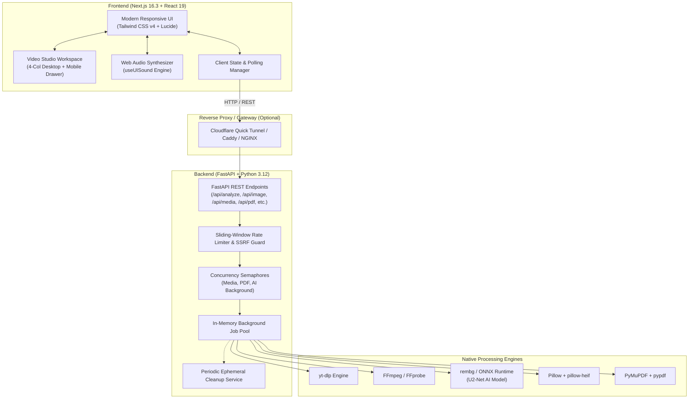

# OnlineFetcherTools ⚡

<div align="center">

[](https://nextjs.org/)
[](https://react.dev/)
[](https://fastapi.tiangolo.com/)
[](https://www.python.org/)
[](https://tailwindcss.com/)
[](https://www.typescriptlang.org/)
[](https://github.com/danielgatis/rembg)
[](https://www.docker.com/)
[](https://opensource.org/licenses/MIT)
[](https://github.com/itsagrim123-blip)

**A calm, powerful, and privacy-first web workspace for all your media downloading, video editing, AI background removal, image conversion, PDF manipulation, and archive workflows.**

### **Developed by Agrim Kaushik**

[Explore Features](#-features--tools-catalog) • [Architecture](#-architecture) • [Tech Stack](#-tech-stack) • [Quickstart](#-quickstart-guide) • [Docker](#-docker-setup) • [Cloudflare Quick Tunnel](#-cloudflare-quick-tunnel-local--vercel) • [API Docs](#-api-documentation) • [Security & Legal](#-security--resource-safeguards) • [Author & License](#-author--license)

---

</div>

## 📖 Overview

**OnlineFetcherTools** (formerly ClipFetch) is a high-performance, privacy-first digital utility suite and media processing workspace developed by **Agrim Kaushik**. 

Engineered for creators, developers, students, and everyday power users, OnlineFetcherTools delivers professional-grade multimedia tools directly through a unified, clutter-free web interface — **100% free of invasive advertisements, trackers, paywalls, or third-party cloud data retention**.

With OnlineFetcherTools, you can:
- 🎬 **Download & analyze permitted media** from supported video platforms with full metadata inspection, custom resolutions, and trimming.
- ✂️ **Edit videos in a studio workspace** featuring a multi-clip timeline, real-time canvas transform, stickers/text overlays, and mobile portrait bottom-sheet controls.
- 🪄 **Remove backgrounds with AI** using CPU-accelerated U2-Net deep learning models, fine edge refinement, and custom background coloring.
- 🖼️ **Convert, compress, and edit photos**, including instant Apple HEIC to JPG conversion, two-way WebP/PNG/JPG pipelines, and lossless compression.
- 📄 **Process PDFs with ease**: merge, split by page ranges, compress stream metadata, extract pages to PNG archives, reorder sheets, and extract plain text.
- 📦 **Create and inspect archives** with built-in path sanitization to guard against directory traversal and Zip-Slip attacks.
- 🔊 **Enjoy tactile audio feedback** powered by a zero-dependency Web Audio synthesizer engine.

> [!IMPORTANT]
> **Permitted Content Notice**: OnlineFetcherTools is strictly engineered for authorized, public domain, and user-owned content. Users are solely responsible for adhering to relevant copyright legislation, intellectual property rights, and third-party platform Terms of Service.

---

## ✨ Features & Tools Catalog

OnlineFetcherTools includes over 20+ specialized utilities organized across 6 dedicated suites:

### 🎬 1. Video & Audio Downloader
* **Real-Time Metadata Analysis**: Inspect video titles, creators, durations, stream bitrates, and thumbnail previews before initiating downloads.
* **Flexible Quality Presets**: Select from high-definition video streams (1080p, 720p, 480p, 360p) or separate high-bitrate audio streams (MP3, WAV, M4A).
* **Direct Timestamp Trimming**: Specify exact start and end timestamps (`HH:MM:SS`) to clip and download only the segment you need.
* **Asynchronous Polling Queue**: Background worker threads with thread-safe progress monitoring (percentage, transfer speed, and estimated completion time).

### ✂️ 2. Studio Video & Audio Suite
* **Full-Featured Studio Video Editor**:
  * **Desktop 4-Column Layout**: Tool drawer, media bin, interactive canvas preview, and properties inspector panel.
  * **Multi-Clip Timeline**: Drag, trim, split, reorder, and sequence multiple video clips with frame-accurate scrubbing.
  * **Interactive Canvas Preview**: Dynamic aspect ratio selector (16:9 widescreen, 9:16 vertical/Reels/Shorts, 1:1 square, 4:5 social), draggable sticker overlays, and text layers.
  * **Mobile Portrait Bottom-Sheet**: Specialized mobile workspace (`MobileBottomSheet`) with optimized touch controls, preventing horizontal drag overflow on low-end devices.
  * **Playback & Audio Controls**: Variable playback speed (0.5x to 2.0x), mute, and clip volume tuning.
  * **Advanced Export Pipeline**: Export directly with selectable resolution, FPS, video codecs, and quality presets via server-side FFmpeg rendering.
* **Video to GIF Converter**: Convert video clips into smooth, optimized animated GIFs with custom FPS and resolution controls.
* **Frame Snapshot Extractor**: Grab frame-accurate, high-resolution snapshots at any timestamp as JPG or PNG.
* **Audio Track Extractor**: Strip audio from video files into standalone MP3, WAV, M4A, or OGG tracks.
* **Media Container Transcoder**: Seamlessly convert between popular media containers (`.mp4`, `.webm`, `.mov`, `.mp3`, `.wav`).

### 🪄 3. AI Background Remover (New!)
* **Deep Learning Subject Segmentation**: CPU-accelerated U2-Net neural network inference powered by `rembg` and ONNX Runtime.
* **Edge Refinement**: Optional fine edge detail enhancement for human hair, fur, and intricate object contours.
* **Interactive Split Comparison Slider**: Real-time interactive before-and-after visual comparison with three viewing modes:
  * *Slider Mode*: Smooth dragging divider to inspect foreground isolation.
  * *Side-by-Side*: Simultaneous before and after preview.
  * *Result Only*: Focused preview on isolated subjects.
* **Custom Background Modes**:
  * Clean Transparent PNG with preserved alpha channel.
  * Crisp Studio White background.
  * Solid Contrast Black background.
  * Custom Color Picker with hex code support.
* **Lossless Output**: Preserves full native image resolution and dimensions.

### 🖼️ 4. Image Processing & Photo Studio
* **Format Conversion**: Instant two-way conversions between **JPG**, **PNG**, and **WebP** formats.
* **Apple HEIC Decoding**: Seamlessly convert iOS `.heic` photos to standard `.jpg` without third-party cloud uploads.
* **Smart Image Compressor**: Dynamic quality sliders providing real-time size reduction calculations while maintaining visual clarity.
* **Image Resizer**: Exact pixel dimension scaling with optional aspect ratio preservation.
* **Image Cropper**: Interactive cropping grid supporting custom dimensions and standard aspect ratios (1:1, 16:9, 4:3, 3:2).
* **Image Rotator & Flipper**: 90°, 180°, 270° orientation rotation along with horizontal and vertical mirror flipping.

### 📄 5. PDF Power Tools
* **PDF Merge**: Combine multiple individual PDF documents into one cleanly sequenced file.
* **PDF Split**: Extract every page into a standalone ZIP archive or extract specific page ranges (e.g., `1-4, 7, 9-12`).
* **PDF Compressor**: Strip redundant stream objects and compress internal PDF structures for smaller file sizes.
* **PDF to Images**: Render entire documents into crisp, high-resolution PNG image bundles packaged in a ZIP archive.
* **Images to PDF**: Compile collections of JPG, PNG, and WebP images into a cohesive, multi-page PDF document.
* **PDF Page Manager**: Visual drag-and-drop workspace to preview page thumbnails, reorder sequences, delete unwanted pages, and re-export.
* **PDF to Text**: Extract raw, searchable text strings into lightweight `.txt` files.

### 📦 6. File & Archive Tools
* **ZIP Creator**: Bundle multiple files of any type into an organized, compressed `.zip` archive.
* **ZIP Inspector**: Safely examine archive hierarchies, file manifests, and uncompressed byte sizes prior to extraction.
* **ZIP Extractor**: Extract archives with rigorous canonical path validation preventing path traversal and Zip-Slip vulnerabilities.

### 🔊 7. Micro-Interactions & Audio Experience (New!)
* **Synthesized Web Audio System**: Zero-dependency audio feedback engine (`useUISound` / `soundManager`) delivering tactile feedback for:
  * File upload initialization
  * Successful task processing
  * Download ready events
  * Interactive button clicks
  * Error alerts
* **Persistent Audio Toggle**: Global sound controls with preference stored in local browser state.
* **Live Server Schedule Widget**: Real-time server running window indicator in headers and mobile drawers.

---

## 🏛 Architecture

OnlineFetcherTools decouples an ultra-responsive **Next.js 16 (App Router)** frontend from an asynchronous **FastAPI** Python processing service.



---

## 🛠 Tech Stack

| Domain | Technology | Version | Details |
| :--- | :--- | :--- | :--- |
| **Frontend Framework** | Next.js | `16.3.4` | App Router, Server & Client Components |
| **UI Library** | React | `19.2.8` | Concurrent rendering, modern hooks |
| **Styling** | Tailwind CSS | `v4` | Modern CSS engine, custom responsive studio breakpoints |
| **Iconography** | Lucide React | `1.41.0` | Lightweight, scalable vector icons |
| **Audio Feedback** | Web Audio API | Native | Synthesized micro-interaction audio effects |
| **Backend Framework** | FastAPI | `0.141.1` | High-throughput asynchronous Python framework |
| **Validation & Config** | Pydantic & Pydantic-Settings | `v2.13+` | Strict type validation, environment parsing |
| **AI Background Removal**| rembg + ONNX Runtime | `2.0.83` | CPU-accelerated U2-Net foreground segmentation |
| **Media Downloader** | yt-dlp | `2026.8.19` | Resilient metadata extraction and media streaming |
| **Video & Audio Engine**| FFmpeg & FFprobe | System | Trimming, transcoding, GIF conversion, multi-clip pipelines |
| **Document Processing** | PyMuPDF & pypdf | `1.26.4` / `6.0.0`| High-speed PDF rendering, page manipulation, text extraction |
| **Image Engine** | Pillow & pillow-heif | `12.3.0` / `1.6.0`| Image manipulation, compression, resizing, HEIC decode |
| **Containerization** | Docker & Compose | Multi-stage | Full containerized deployment with bundled FFmpeg |

---

## 📂 Project Structure

```text
onlinefetchertools/
├── .env.example              # Global environment configuration template
├── .gitignore                # Git ignore patterns (.venv, node_modules, downloads)
├── docker-compose.yml        # Multi-container orchestration (Next.js + FastAPI)
├── README.md                 # Project documentation
├── scripts/                  # Automated PowerShell helper scripts
│   ├── start-backend.ps1     # Launch FastAPI with custom CORS origins
│   ├── check-backend.ps1     # Verify local or remote backend health
│   └── start-cloudflared.ps1 # Launch zero-config Cloudflare Quick Tunnel
├── backend/
│   ├── app/
│   │   ├── config.py         # Pydantic Settings & environment variables
│   │   ├── errors.py         # Unified error handling & exceptions
│   │   ├── main.py           # FastAPI entrypoint, middleware, lifespan
│   │   ├── models.py         # Pydantic request/response schemas
│   │   ├── routes/
│   │   │   ├── archive.py    # ZIP create, inspect, extract endpoints
│   │   │   ├── file.py       # Video editing, convert, GIF, frame extraction
│   │   │   ├── health.py     # Health status and HTML dashboard
│   │   │   ├── image.py      # Convert, compress, crop, resize, and remove-background
│   │   │   ├── media.py      # yt-dlp analyze & background download routes
│   │   │   └── pdf.py        # PDF merge, split, compress, page manager, text
│   │   ├── services/
│   │   │   ├── archive_tools.py      # Zipfile handling routines
│   │   │   ├── background_remover.py # rembg AI session & U2-Net warmup
│   │   │   ├── cleanup.py            # Ephemeral temp file lifecycle manager
│   │   │   ├── downloader.py         # Thread-safe download job monitor
│   │   │   ├── extractor.py          # yt-dlp metadata wrapper
│   │   │   ├── image_tools.py        # Pillow, HEIC, and background removal processing
│   │   │   ├── media_tools.py        # FFmpeg process execution & filters
│   │   │   └── pdf_tools.py          # PyMuPDF and pypdf routines
│   │   └── utils/
│   │       ├── concurrency.py        # Concurrency semaphores (Media, PDF, AI)
│   │       ├── files.py              # File lifecycle & upload handling
│   │       ├── rate_limit.py         # In-memory sliding-window rate limiters
│   │       └── validation.py         # SSRF protection & input validation
│   ├── Dockerfile            # Python 3.12-slim + FFmpeg production container
│   ├── requirements.txt      # Python dependencies
│   └── tests/                # Pytest suites (health, validation, routes)
└── frontend/
    ├── app/
    │   ├── globals.css       # Tailwind CSS v4 styling & dark scrollbar utilities
    │   ├── layout.tsx        # Base root layout, navigation header, footer
    │   ├── page.tsx          # Homepage with tool catalog & instant search
    │   └── tools/[slug]/     # Dynamic tool workspace runner
    ├── components/
    │   ├── BackendStatus.tsx # Live backend health & running schedule indicator
    │   ├── DownloaderCard.tsx# Interactive media downloader component
    │   ├── Header.tsx        # Responsive navigation with tools dropdown
    │   ├── Footer.tsx        # Footer with copyright and legal disclaimer
    │   ├── SoundToggle.tsx   # Global Web Audio sound effects toggle
    │   └── tools/
    │       ├── BackgroundRemoverWorkspace.tsx # AI background remover with split comparison
    │       ├── FileToolWorkspace.tsx          # General file & media convert workspace
    │       ├── PdfPageManagerWorkspace.tsx    # Visual PDF page reorder/delete
    │       ├── PhotoEditorWorkspace.tsx       # Cropping, resizing, rotation studio
    │       ├── ZipExtractorWorkspace.tsx      # Archive inspection & extraction
    │       └── video-editor/                  # Comprehensive Studio Video Editor
    │           ├── components/
    │           │   ├── CanvasPreview.tsx      # Video canvas with overlays & aspect ratios
    │           │   ├── Timeline.tsx           # Multi-clip visual timeline
    │           │   ├── ExportModal.tsx        # Export configuration modal
    │           │   └── mobile/                # MobileBottomSheet & touch controls
    │           └── types.ts                   # Editor state & clip type definitions
    ├── lib/
    │   ├── api.ts            # Client API client with streaming & download helpers
    │   └── sounds/
    │       ├── soundManager.ts # Synthesized Web Audio API sound generator
    │       └── useUISound.ts   # React hook for UI audio micro-interactions
    ├── Dockerfile            # Node 20-alpine Next.js production build
    ├── package.json          # Node dependencies & npm scripts
    └── tsconfig.json         # TypeScript configuration
```

---

## 📋 Prerequisites

Before running OnlineFetcherTools locally, ensure your environment meets the following requirements:

- **Node.js**: `v20.0.0+`
- **npm**: `v10.0.0+`
- **Python**: `3.12+`
- **FFmpeg & FFprobe**: Installed and available on your system `PATH`

### FFmpeg Installation

<details>
<summary><b>Windows</b></summary>

Install via Windows Package Manager (`winget`):
```powershell
winget install Gyan.Dev.FFmpeg
```
*Alternatively, download a build from [ffmpeg.org](https://www.ffmpeg.org/download.html) and append the `bin/` directory to your System Environment `PATH`.*

Verify installation:
```powershell
ffmpeg -version
ffprobe -version
```
</details>

<details>
<summary><b>macOS</b></summary>

Install via Homebrew:
```bash
brew install ffmpeg
```
</details>

<details>
<summary><b>Linux (Ubuntu/Debian)</b></summary>

```bash
sudo apt-get update
sudo apt-get install -y ffmpeg
```
</details>

---

## 🚀 Quickstart Guide

### 1. Clone the Repository
```bash
git clone https://github.com/itsagrim123-blip/onlinefetchertools.git
cd onlinefetchertools
```

### 2. Configure Environment Variables
Copy the root `.env.example` template:

**Bash / macOS / Linux:**
```bash
cp .env.example .env
cp .env.example frontend/.env.local
```

**PowerShell (Windows):**
```powershell
Copy-Item .env.example .env
Copy-Item .env.example frontend/.env.local
```

---

### 3. Backend Setup

**Windows (PowerShell):**
```powershell
# Create and activate virtual environment
python -m venv .venv
.\.venv\Scripts\Activate.ps1

# Install dependencies (including AI background removal engine)
pip install -r backend\requirements.txt

# Start FastAPI backend server
cd backend
uvicorn app.main:app --reload --port 8000
```

**Linux / macOS:**
```bash
# Create and activate virtual environment
python3 -m venv .venv
source .venv/bin/activate

# Install dependencies
pip install -r backend/requirements.txt

# Start FastAPI backend server
cd backend
uvicorn app.main:app --reload --port 8000
```

> **Backend Verification:**
> - HTML Dashboard / Status: [http://localhost:8000](http://localhost:8000)
> - Interactive OpenAPI Swagger UI: [http://localhost:8000/docs](http://localhost:8000/docs)
> - System Health Check: [http://localhost:8000/api/health](http://localhost:8000/api/health)

---

### 4. Frontend Setup

Open a new terminal in the project root directory:

```bash
cd frontend
npm install
npm run dev
```

> **Frontend Access:**
> - Web Application: [http://localhost:3000](http://localhost:3000)

---

### 5. Running Automated Tests

**Backend (Pytest):**
```bash
pytest backend/tests -v
```

**Frontend (Jest & Testing Library):**
```bash
cd frontend
npm test
```

---

## 🐳 Docker Setup

OnlineFetcherTools includes full multi-container Docker Compose configuration. FFmpeg binaries, Python libraries, Node dependencies, and permissions are pre-configured.

```bash
# Build and run containers in background
docker compose up --build
```

- **Frontend**: `http://localhost:3000`
- **Backend**: `http://localhost:8000`
- Downloaded and temporary files reside safely within the `backend_downloads` Docker volume.

To shut down containers:
```bash
docker compose down
```

---

## 🌐 Cloudflare Quick Tunnel (Local + Vercel)

If your frontend is hosted on **Vercel** and you want to connect it to your local backend without opening router ports or paying for cloud servers, launch a zero-config Cloudflare Quick Tunnel:

```text
[ Vercel Frontend (HTTPS) ] 
       │
       ▼
[ Cloudflare Quick Tunnel (https://*.trycloudflare.com) ]
       │
       ▼
[ Local Development Machine (http://localhost:8000) - FastAPI ]
```

### Steps:

1. **Install `cloudflared`**:
   - Download the official binary from [Cloudflare](https://developers.cloudflare.com/cloudflare-one/connections/connect-networks/downloads/) or place `cloudflared.exe` on your system.
2. **Execute Automated Helper Scripts**:

   ```powershell
   # Terminal 1: Start backend with your Vercel origin allowed in CORS
   powershell.exe -NoProfile -ExecutionPolicy Bypass -File .\scripts\start-backend.ps1 -FrontendOrigin https://your-project.vercel.app

   # Terminal 2: Verify local backend readiness
   powershell.exe -NoProfile -ExecutionPolicy Bypass -File .\scripts\check-backend.ps1

   # Terminal 3: Launch the Cloudflare Tunnel
   powershell.exe -NoProfile -ExecutionPolicy Bypass -File .\scripts\start-cloudflared.ps1
   ```

3. **Link to Vercel**:
   - Copy the generated `https://<unique-subdomain>.trycloudflare.com` URL printed in Terminal 3.
   - In **Vercel Project Settings > Environment Variables**, set `NEXT_PUBLIC_API_URL` to that URL.
   - Redeploy the frontend.

---

## 🚢 Production Deployment

```text
+------------------------------+            +---------------------------------+
|      Vercel Deployment       |            |   Docker Host (VPS / Cloud VM)  |
|    (Next.js 16 Frontend)     | ---------> |   (FastAPI + rembg + FFmpeg)    |
|   NEXT_PUBLIC_API_URL        |   HTTPS    |      FRONTEND_ORIGIN            |
+------------------------------+            +---------------------------------+
```

> [!WARNING]
> **Do not deploy the FastAPI backend to a serverless function** (e.g. AWS Lambda or Vercel Serverless). Long-running FFmpeg transcode operations, ONNX AI inference, and yt-dlp stream downloading require a persistent server environment with native binaries.

### 1. Backend on a VPS (Docker)
```bash
# Build backend container
docker build -t onlinefetchertools-backend ./backend

# Run container with persistent storage and Vercel origin
docker run -d --name onlinefetchertools-backend \
  --restart unless-stopped \
  -p 8000:8000 \
  -e FRONTEND_ORIGIN="https://onlinefetchertools.vercel.app" \
  -v onlinefetchertools-downloads:/app/downloads \
  onlinefetchertools-backend
```

### 2. Frontend on Vercel
1. Import repository into [Vercel](https://vercel.com/).
2. Set the **Root Directory** to `frontend`.
3. Add Environment Variable:
   - `NEXT_PUBLIC_API_URL`: `https://api.yourdomain.com` (or your Cloudflare Tunnel URL).
4. Click **Deploy**.

---

## ⚙️ Configuration & Environment Variables

| Variable | Default Value | Description |
| :--- | :--- | :--- |
| `BACKEND_PORT` | `8000` | Port for the FastAPI backend server |
| `FRONTEND_ORIGIN` | `http://localhost:3000,http://127.0.0.1:3000` | Allowed CORS origins (comma-separated list) |
| `NEXT_PUBLIC_API_URL` | `http://localhost:8000` | Backend API base URL consumed by the Next.js frontend |
| `MAX_DOWNLOAD_SIZE_MB`| `2048` | Maximum permissible downloaded media size in MB |
| `MAX_UPLOAD_SIZE_MB` | `200` | Maximum permissible file upload size in MB |
| `MAX_CONCURRENT_DOWNLOADS` | `2` | Number of simultaneous background download worker threads |
| `TEMP_FILE_RETENTION_MINUTES` | `30` | Time after which completed ephemeral files are pruned |
| `MAX_ANALYZE_REQUESTS_PER_MINUTE` | `20` | Rate limit for URL metadata inspection requests |
| `MAX_DOWNLOAD_REQUESTS_PER_MINUTE` | `10` | Rate limit for media download job creation |
| `DOWNLOAD_DIR` | `downloads` | Local directory for storing temporary output files |
| `REQUEST_TIMEOUT_SECONDS` | `45` | HTTP request timeout for metadata inspection |
| `RATE_LIMIT_WINDOW_SECONDS` | `60` | Rolling time window in seconds for client IP rate limiters |

---

## 📡 API Documentation

Interactive API documentation is generated by FastAPI:
- **Swagger UI**: `http://localhost:8000/docs`
- **ReDoc**: `http://localhost:8000/redoc`
- **Server Health Dashboard**: `http://localhost:8000/`

### Primary Endpoints

| Method | Endpoint | Description |
| :--- | :--- | :--- |
| `GET` | `/api/health` | Healthcheck (yt-dlp, FFmpeg, and storage readiness) |
| `POST`| `/api/analyze` | Validate URL and extract media metadata & formats |
| `POST`| `/api/download` | Queue background media download job |
| `GET` | `/api/download/{job_id}/status` | Poll download job status, progress %, and speed |
| `GET` | `/api/download/{job_id}/file` | Stream or download the completed media file |
| `POST`| `/api/image/remove-background` | **(New)** AI background removal with U2-Net, edge refinement & custom color |
| `POST`| `/api/image/convert` | Convert images between JPG, PNG, and WebP |
| `POST`| `/api/image/compress` | Compress image with adjustable quality slider |
| `POST`| `/api/image/resize` | Resize image by width/height maintaining aspect ratio |
| `POST`| `/api/image/crop` | Crop image with bounding box coordinates |
| `POST`| `/api/image/rotate` | Rotate (90/180/270°) and flip (horizontal/vertical) |
| `POST`| `/api/media/convert` | Transcode audio or video to another format |
| `POST`| `/api/media/edit` | Trim, resize, or alter playback speed of a video |
| `POST`| `/api/media/video-to-gif` | Convert video clip into an animated GIF |
| `POST`| `/api/media/extract-frame`| Extract an exact video frame at a given timestamp |
| `POST`| `/api/pdf/merge` | Merge multiple PDF files into one |
| `POST`| `/api/pdf/split` | Split PDF into individual pages or specific ranges |
| `POST`| `/api/pdf/compress` | Compress PDF document streams |
| `POST`| `/api/pdf/to-images` | Convert PDF pages into PNG images in a ZIP |
| `POST`| `/api/pdf/from-images` | Convert multiple image uploads into a single PDF |
| `POST`| `/api/pdf/manage` | Reorder and delete specific pages from a PDF |
| `POST`| `/api/pdf/to-text` | Extract readable text content from a PDF |
| `POST`| `/api/file/create-zip` | Package multiple files into a clean ZIP archive |
| `POST`| `/api/file/inspect-zip`| View archive structure and file sizes before extracting |
| `POST`| `/api/file/extract-zip`| Securely unpack archive contents |

---

## 🔒 Security & Resource Safeguards

OnlineFetcherTools is built with defensive engineering standards:

* **Strict SSRF Mitigation**: Every video URL is parsed and validated against RFC 1918 private subnets, loopback addresses (`127.0.0.1`, `localhost`), link-local IPs, and cloud metadata endpoints (`169.254.169.254`).
* **Concurrency Semaphores**: CPU/RAM-heavy operations (AI background removal, FFmpeg video encoding, PDF manipulation, and archive decompression) run behind dedicated asynchronous semaphores.
* **Upload & Download Ceilings**: Strict byte limits prevent buffer exhaustion or disk-filling exploits (`MAX_DOWNLOAD_SIZE_MB` and `MAX_UPLOAD_SIZE_MB`).
* **Zip-Slip Attack Immunity**: Canonical path verification ensures archive extractors cannot overwrite files outside the temporary working directory.
* **Ephemeral Workspaces**: Every file operation takes place in an isolated UUID directory. Completed files are removed immediately upon transmission or purged automatically by the `CleanupService`.

---

## ⚖️ Legal & Ethical Notice

OnlineFetcherTools is developed for educational, archival, and legitimate utility purposes.

* Users must possess all necessary legal rights, licenses, or explicit permissions from copyright holders before processing any media.
* OnlineFetcherTools does **not** bypass DRM, encryption, access controls, paid subscriptions, or paywalls.
* The maintainers assume no liability for misuse, copyright infringement, or violation of third-party Terms of Service committed by end users.

---

## 👨‍💻 Author & Credits

**OnlineFetcherTools** is designed and developed by **Agrim Kaushik**.

* **Lead Developer**: [Agrim Kaushik](https://github.com/itsagrim123-blip)
* **GitHub Repository**: [itsagrim123-blip/onlinefetchertools](https://github.com/itsagrim123-blip/onlinefetchertools)

Contributions, feature requests, and feedback are always welcome! Feel free to open an issue or submit a pull request.

---

## 📄 License

This project is licensed under the **MIT License** — see the [LICENSE](LICENSE) file for details.

<div align="center">

Made with ❤️ by **Agrim Kaushik** for a cleaner, calmer, and more powerful web.

</div>
